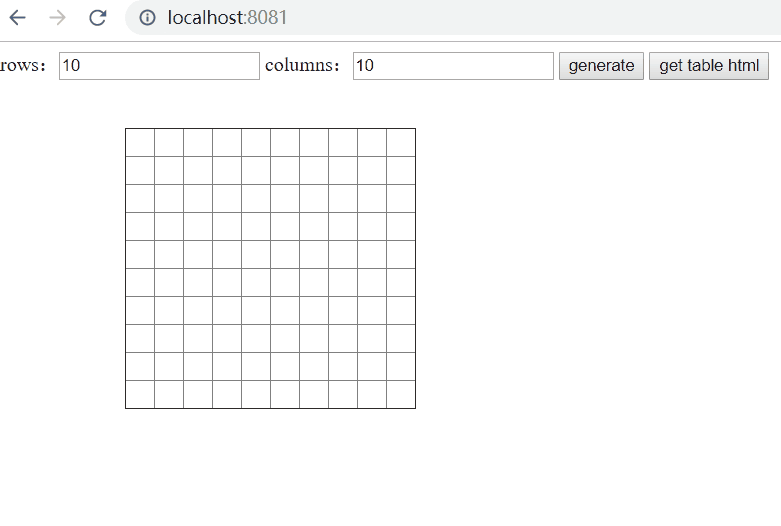

### 原生javascript表格插件，可以拖动改变大小，合并单元格等

> Demo  



> 安装

### npm install  

### npm run dev  

### 查看 localhost:8080

> 
### 三种方式 初始化表格
```javascript
import TableEditor from "./tableEditor"
// better to replace document.body with your own div container
// 最好把body换成某个空的div容器，这个div不要放其他元素
const t = new TableEditor()

t.Create(10, 10, document.body)

// or
t.CreateFromString('<table><tr><td></td><td></td></tr><tr><td></td><td></td></tr></table>',document.body)

// or
t.CreateFromElem(document.querySelector('#YourTable'),document.body)

// do some edit .....

// 编辑完表格以后获取编辑后的结果
// get the edited table
console.log(t.GetTable())
console.log(t.GetTableStr())
```

卧槽，放了这么久了，真就一个屎大都没有啊
